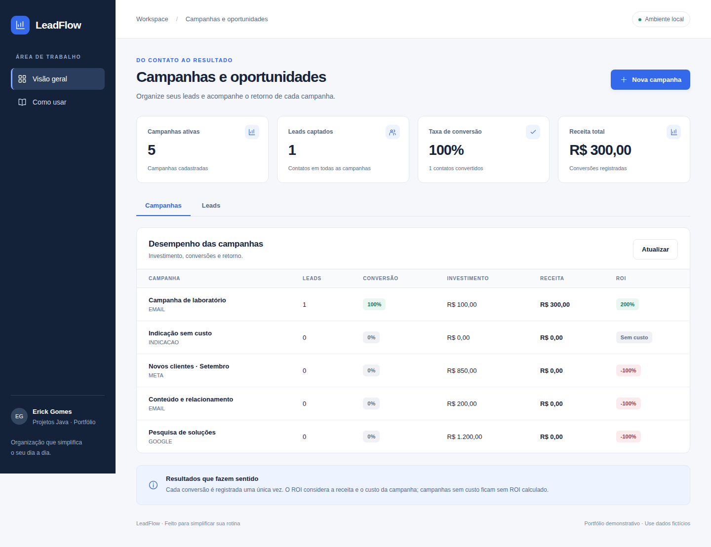
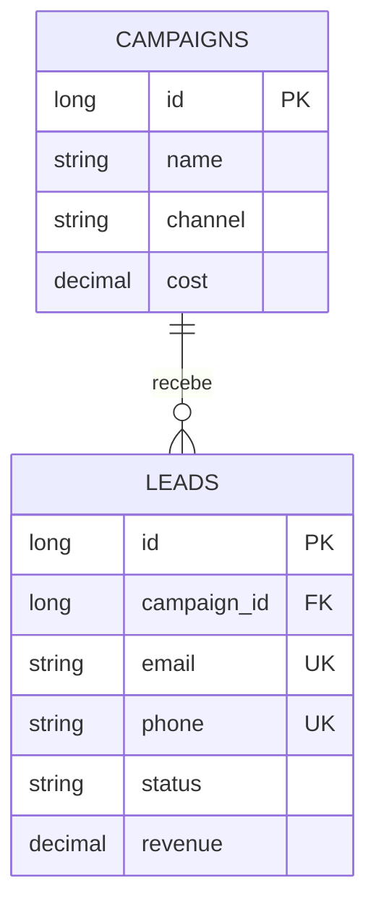

# LeadFlow · Java com interface web

## Interface web · versão 1.1.0



Execute `java -jar target/app.jar` e abra **http://localhost:8082**. Use os formulários e botões para cadastrar e acompanhar seus dados. [Guia da interface e atualização](docs/INTERFACE.md).

O front-end responsivo é embarcado no JAR, sem instalação de Node para o usuário. A automação em **Actions** valida Java e fluxos de navegador e entrega um ZIP Windows com iniciador e checksum. Publicações versionadas ficam disponíveis pelo workflow **Publicar versão**.


API para organizar leads de campanhas, evitar duplicidades e calcular indicadores de conversão, custo e retorno.

**Java 17 · Spring Boot 4.0.7 · REST · Collections/Streams · JDBC · SQL · BigDecimal · JUnit**

Projeto didático de portfólio de [Erick Gomes](https://github.com/Gmerick), criado com apoio de IA e dados fictícios. Inspirado em organização de leads e análise operacional. Não integra CRM, discador ou plataformas de marketing reais.

## O problema

Leads duplicados e conversões contabilizadas mais de uma vez distorcem a avaliação de uma campanha. A API normaliza telefone e e-mail, protege a unicidade no banco e permite uma única conversão por lead.

## Executar

Pré-requisitos: **JDK 17+**, **Maven 3.6.3+**, Git. Confira `java -version`, `javac -version` e `mvn -version`. A primeira compilação precisa de internet.

```bash
git clone https://github.com/Gmerick/java-leadflow-api.git
cd java-leadflow-api
mvn clean verify
java -jar target/app.jar
```

API: **http://localhost:8082**. A interface de uso está disponível na raiz `/`. Para ver os indicadores no navegador, abra `http://localhost:8082/api/reports/campaigns`. O banco fica em `data/leadflow.mv.db`.

Com Python 3 instalado, abra outro terminal na mesma pasta e rode:

```bash
python scripts/demo.py
```

A demonstração cria uma campanha com custo 100, dois leads, uma conversão de 300 e verifica **50% de conversão, custo por lead 50 e ROI de 200%**. Também testa duplicidade e reconversão. Cada execução cria dados fictícios novos.

Alternativa: use as [requisições HTTP](examples/requests.http) ou PowerShell:

```powershell
$body = @{ name='Campanha laboratorio'; channel='EMAIL'; cost=100.00 } | ConvertTo-Json
$campaign = Invoke-RestMethod -Method Post -Uri 'http://localhost:8082/api/campaigns' -ContentType 'application/json' -Body $body
$body = @{ campaignId=$campaign.id; name='Pessoa Exemplo'; email='pessoa@example.com'; phone='11900000001' } | ConvertTo-Json
$lead = Invoke-RestMethod -Method Post -Uri 'http://localhost:8082/api/leads' -ContentType 'application/json' -Body $body
Invoke-RestMethod -Method Patch -Uri "http://localhost:8082/api/leads/$($lead.id)/conversion" -ContentType 'application/json' -Body '{"revenue":300.00}'
Invoke-RestMethod -Uri 'http://localhost:8082/api/reports/campaigns'
```

O exemplo manual com um lead gera conversão de 100%, CPL de 100 e ROI de 200%. Repetir telefone/e-mail retorna 409.

## Endpoints

| Método | Rota | Resultado |
| --- | --- | --- |
| POST | `/api/campaigns` | Cria campanha com nome, canal e custo |
| GET | `/api/campaigns` | Lista campanhas |
| GET | `/api/campaigns/{id}` | Consulta campanha |
| POST | `/api/leads` | Cria lead válido sem duplicar telefone/e-mail |
| GET | `/api/leads?campaignId=1&limit=20&offset=0` | Lista leads; filtro de campanha opcional |
| GET | `/api/leads/{id}` | Consulta lead |
| PATCH | `/api/leads/{id}/conversion` | Converte e registra receita positiva uma única vez |
| GET | `/api/reports/campaigns` | Calcula indicadores de cada campanha |

Criação retorna **201 + Location**. Erros: **400** campos inválidos, **404** registro ausente, **409** duplicidade/conversão repetida. `limit`: 1 a 100; `offset`: não negativo.

## Regras de negócio

- Telefone brasileiro com DDD, 10 ou 11 dígitos; aceita código 55 e formatação usual, salva somente DDD+número. É validação de formato, sem confirmação de existência/titularidade.
- E-mail em minúsculas, validado no DTO. Telefones e e-mails são **únicos globalmente**, inclusive entre campanhas.
- Um lead pertence a uma única campanha: modelo simplificado de atribuição, sem múltiplos pontos de contato.
- Estado `NEW` com receita 0; após conversão, estado `CONVERTED` com receita positiva. Reconversão retorna 409 e preserva a receita original.
- Custo não negativo, receita positiva, até duas casas decimais e 10 dígitos inteiros. Dinheiro usa BigDecimal, não double.

## Indicadores

| Indicador | Fórmula / regra |
| --- | --- |
| Conversão (%) | convertidos ÷ leads × 100; sem leads = 0 |
| CPL | custo ÷ leads; sem leads = null |
| Receita | soma das receitas registradas |
| ROI (%) | (receita − custo) ÷ custo × 100; custo zero = null |

`null` significa que a divisão não é definida. O ROI é simplificado: não considera impostos, margem ou custos externos. Arredondamento HALF_UP em duas casas. O relatório agrupa leads com `Map<Long,List<Lead>>` e Streams, incluindo campanhas vazias.

## Arquitetura e modelo

- `LeadController`: DTOs, validação e rotas.
- `LeadService`: normalização, conversão e indicadores com Collections.
- `LeadRepository`: SQL parametrizado via JdbcTemplate.
- `Campaign` / `Lead`: records e enum de estado.
- `ApiErrors`: ProblemDetail para erros esperados.



[Consultas SQL equivalentes](examples/queries.sql) ajudam a comparar Streams com GROUP BY no banco.

## Configuração e opções

| Variável | Padrão |
| --- | --- |
| `PORT` | `8082` |
| `SERVER_ADDRESS` | `127.0.0.1` |
| `DB_URL` | `jdbc:h2:file:./data/leadflow` |
| `DB_USERNAME` | `sa` |
| `DB_PASSWORD` | vazio, apenas laboratório local |

Banco temporário: `java -jar target/app.jar --spring.datasource.url=jdbc:h2:mem:demo`. Outra porta: `--server.port=9082`; nesse caso, use `python scripts/demo.py http://localhost:9082`.

```bash
mvn clean verify
# Opcional, requer Docker:
docker compose up --build -d
docker compose down
```

Pare a aplicação Java antes de usar Compose na mesma porta. O volume preserva dados. Para reiniciar o banco de arquivo, pare a aplicação e renomeie a pasta `data` como backup.

- [Apresentação de 5 a 10 minutos](docs/APRESENTACAO.md)
- [Guia de estudo](docs/ESTUDO.md)
- [Decisões técnicas](docs/DECISOES.md)
- [Resultados de validação](docs/VALIDACAO.md)
- [Proposta de laboratório AWS](docs/AWS.md)

## Limitações

Sem autenticação, dados reais, importação CSV ou envio a CRM. Lista de campanhas e relatório não são paginados; o relatório carrega todos os leads em memória para fins didáticos. Para grandes volumes, executar agregações no banco e paginar campanhas. Não houve implantação na AWS.
